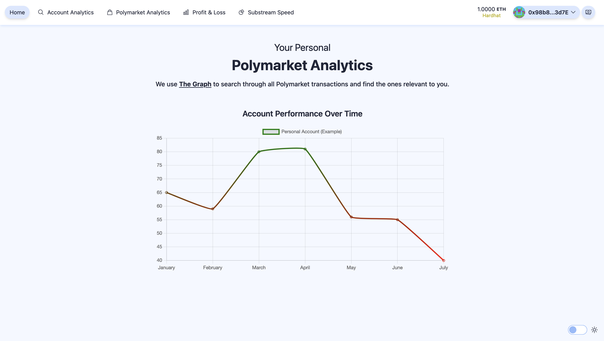

# Polymarket Analytics




## Short Description

Polymarket Analytics lets you to fetch and analyze trades made by any account on Polymarket, bypassing the platform's viewing limitations. Track profit and loss over time, inspect impactful trades, and uncover trading strategies. Built using Scaffold-ETH-2 and custom subgraphs/substreams for insights.

## Features

- **Trade Analysis**: Fetch and analyze all trades made by any account on Polymarket.
- **Profit and Loss Tracking**: Track profit and loss over time.
- **Impactful Trades Inspection**: Inspect impactful trades.
- **View Big Payout Redemptions**: Custom substream allows you to see the biggest Payout Redemptions on Polymarket 
- **Custom Subgraphs**: Built using Scaffold-ETH-2 and custom subgraphs for deep insights.

## Getting Started

### Prerequisites

- Node.js
- Yarn
- Hardhat
- Next.js

### Installation

1. Clone the repository:
    ```sh
    git clone https://github.com/your-repo/polymarket-analytics.git
    ```
2. Navigate to the project directory:
    ```sh
    cd polymarket-analytics
    ```
3. Install dependencies:
    ```sh
    yarn install
    ```

### Usage

1. Start the development server:
    ```sh
    yarn dev
    ```
2. Open your browser and navigate to `http://localhost:3000`.


## Acknowledgements

- The Graph (special Thanks to Giuliano)
- Scaffold-ETH-2
- Polymarket
